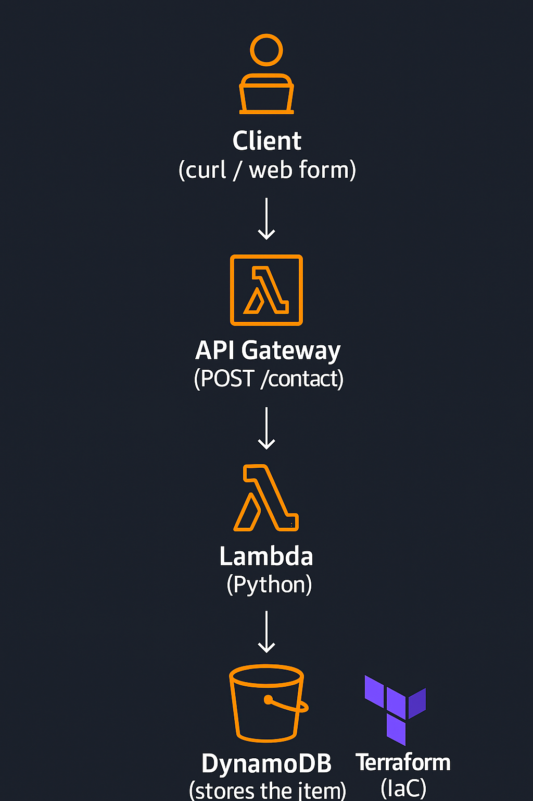

# ☁️ Serverless Contact Form API (AWS)


**Author:** Calvin Williams – Cloud Computing Student | AWS & Security Enthusiast


## What this is
A small **serverless backend** that accepts a contact message (name, email, message) and saves it to **DynamoDB** using:
- **API Gateway** (POST `/contact`)
- **AWS Lambda (Python)**
- **Amazon DynamoDB**
- **Terraform** (Infrastructure as Code)

## How it flows

```
Client (curl / web form)

→ API Gateway (POST /contact)

→ Lambda (Python)

→ DynamoDB (stores the item)
```

---

## 🏗️ Architecture Diagram


---

## 🚀 Setup & Deployment

### 🧩 Prerequisites
Before you begin, make sure you have the following installed:

- **AWS CLI** (configured with your IAM credentials)
👉 [Install AWS CLI](https://docs.aws.amazon.com/cli/latest/userguide/getting-started-install.html)
- **Terraform** (v1.5+ recommended)
👉 [Install Terraform](https://developer.hashicorp.com/terraform/downloads)
- **Python 3.9+** (for Lambda function code)
- **Git** (to clone and push changes)

  ## Project Structure
```
  serverless-contact-api/

│

├── assets/                 # Contains the architecture diagram

├── lambda/                 # Python code for AWS Lambda function

│   └── handler.py          # Lambda entry point

├── infra/                  # Terraform configuration files

│   ├── main.tf             # Main Terraform setup

│   ├── variables.tf        # Variables used by Terraform

│   └── outputs.tf          # Outputs from the deployment

├── requirements.txt        # Python dependencies

├── README.md               # Project documentation (you’re reading it!)

└── .gitignore              # Git ignore rules

---

### ⚙️ How to Deploy

### 🚀 Deploying the Infrastructure

1. **Clone this repository**
   
```bash

git clone https://github.com/CalWill30/Serverless-contact-api.git
cd Serverless-contact-api

2. **Install dependencies**

```bash

pip install -r requirements.txt


---

### 💡 About the Author
Built with ☁️ **AWS** | 🧱 **Terraform** | 💬 **Python**
**Calvin Williams** – Cloud Computing Student | AWS & Security Enthusiast
📫 [Connect with me on LinkedIn](https://www.linkedin.com/in/calwill30)
